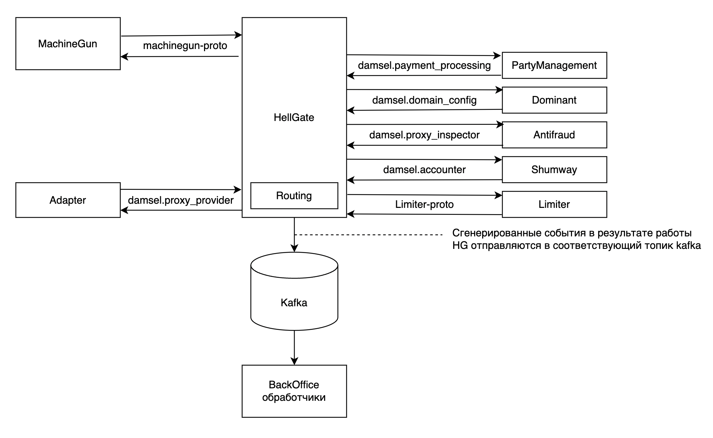

# Реализация

## Модель

`Hellgate` представляет собой сервис, написанный на Erlang, 
реализующий событийную модель данных и использующий [thrift](https://ru.wikipedia.org/wiki/Apache_Thrift) для взаимодействия 
между сервисами.

Среди особо важных вспомогательных сервисов можно выделить:
- сервис антифрода (`Fraudo`)
- сервис подсчета лимитов (`Limiter`)
- сервис управления балансами (`Shumway`)
- сервис управления пати-шопами (`Party-Management`)
- сервис управления машинами ([Machinegun](docs/machinegun/overview.md))
- можеством адаптеров для взаимодействия с провайдерами

Абстрактное взаимодействие `HG` с другими (основными) сервисами
представлено на рисунке ниже.

Как можно понять из схемы выше основным протоколом (на данный момент) 
является [damsel](https://github.com/valitydev/damsel). Каждое 
сгенерированное событие в качестве машины записывается в [RIAK](https://ru.wikipedia.org/wiki/Riak) 
(используя [machinegun](docs/machinegun/overview.md)), а для более удобной работы BackOffice части 
в ряд топиков kafka.
