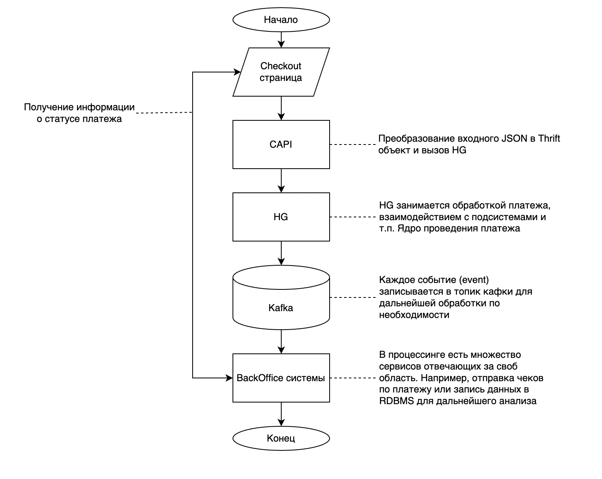
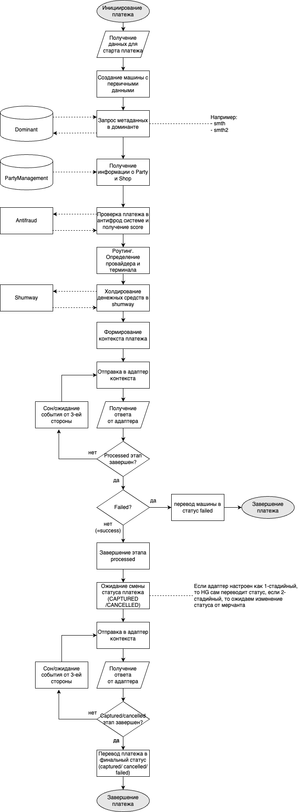

# Работа с платежами. Реализация

## Немного о платеже

Платеж - это перевод денежных средств со счета одного участника 
товарно-денежных отношений на счет другого. Способ проведения платежа
(при помощи карты, банковского перевода, qr-кода и т.п.) не имеет значения.

## Алгоритм проведения платежа

Работа с платежами является основной задачей HellGate. Он должен обеспечивать как высокую скорость работы, 
так и надежность выполнения. Стандартный подход к проведению платежа выглядит следующим образом:
1. Инициируется платеж. Он может быть начат как на checkout странице разработанной vality.dev, так и через API 
(API прописано в [swag-payments](https://github.com/valitydev/swag-payments))
2. После этого платеж в зависимости от необходимости работы с карточными данными попадает либо в 
[CAPI](https://github.com/valitydev/capi-v2), либо в [CAPI-PCIDSS](https://github.com/valitydev/capi-pcidss-v2)). 
Сервис выполняет роль едтиной точки входа через API (маппит данные и использует определенный исполнитель). 
В случае платежа с использованием [интерфейса, описанного в damsel](https://github.com/valitydev/damsel/blob/master/proto/payment_processing.thrift#L1040), 
CAPI вызывает HellGate и платеж начинает обрабатываться.
3. Hellgate обогащает входные данные дополнительной информацией, проводит проверки и обрабатывает платеж. 
4. Страница, инициирующая платеж, получает данные о статусе платежа

Краткая иллюстрация алгоритма проведения платежа представлена на рисунке ниже


Самым важным в данной схеме является этап обработки в HG, который далее и будет рассмотрен.


## Обработка платежа в HG

Последовательность действий после получения данных платежа от CAPI следующая:
1. Старт платежа в HG. Происходит когда внешняя система (например, CAPI) вызывает 
RPC исполнитель [damsel.payment_processing.Invoiceing.create](https://github.com/valitydev/damsel/blob/master/proto/payment_processing.thrift#L1042).
в него передается следующая структура:
```plantuml
struct InvoiceParams {
    1: required PartyID party_id
    2: required ShopID shop_id
    3: required domain.InvoiceDetails details
    4: required base.Timestamp due
    5: required domain.Cash cost
    6: required domain.InvoiceContext context
    7: required domain.InvoiceID id
    8: optional string external_id
    9: optional domain.InvoiceClientInfo client_info
    10: optional domain.AllocationPrototype allocation
}
```
2. Получив входный данные Hellgate преобразует их и [создает новую машину](https://github.com/valitydev/machinegun-proto/blob/master/proto/state_processing.thrift#L416) 
в сервисе machinegun (интерфейс создания - [machinegun_proto.state_processing.Automation.Start](https://github.com/valitydev/machinegun-proto/blob/master/proto/state_processing.thrift#L416)).
Структура [машины](https://github.com/valitydev/machinegun-proto/blob/master/proto/state_processing.thrift#L82) выглядит следующим образом:
```plantuml
/**
 * Машина — конечный автомат, обрабатываемый State Processor'ом.
 */
struct Machine {
    /** Пространство имён, в котором работает машина */
    1: required base.Namespace ns;

    /** Основной идентификатор машины */
    2: required base.ID  id;

    /**
     * Сложное состояние, выраженное в виде упорядоченного набора событий
     * процессора.
     * Список событий упорядочен по моменту фиксирования его в
     * системе: в начале списка располагаются события, произошедшие
     * раньше тех, которые располагаются в конце.
     */
    3: required History history;

    /**
     * Диапазон с которым была запрошена история машины.
     */
    4: required HistoryRange history_range;

    /**
     * Упрощенный статус машины
     */
    8: optional MachineStatus status;

    /**
     * Вспомогательное состояние — это некоторый набор данных, характеризующий состояние,
     * и в отличие от событий не сохраняется в историю, а каждый раз перезаписывается.
     * Бывает полезен, чтобы сохранить данные между запросами, не добавляя их в историю.
     */
    7: optional AuxState aux_state;

    /**
     * Текущий активный таймер (точнее, дата и время когда таймер сработает).
     */
    6: optional base.Timestamp timer;

    // deallocated / reserved
    // 5: optional AuxStateLegacy aux_state_legacy

}
```

3. Далее HG дозапрашивает метаинформацию из сервиса dominant ([интерфейс работы с dominant](https://github.com/valitydev/damsel/blob/master/proto/domain_config.thrift#L171)) (todo: какую?)
4. Получение дополнительной информации о пати-шопу из сервиса party-management ([интерфейс работы с party-management](https://github.com/valitydev/damsel/blob/master/proto/payment_processing.thrift#L2532)) (по необходимости)
5. Проверка платежа в антифрод системе ([интерфейс работы с антифродом](https://github.com/valitydev/damsel/blob/master/proto/proxy_inspector.thrift#L54))
6. [Роутинг](routing-workflow.md). Один из важнейших этапов при проведении платежа.
Здесь определяется через какого провайдера и какой терминал будет осуществлен платеж. 
Выбор зависит от многих параметров, но основные это доступность провайдера, лимиты, результат проверки антифродом.
7. После того как провайдер, через которого будет проведен платеж, был определен, 
происходит холдирование денежных средств в сервисе shumway 
([интерфейс для работы с shumway](https://github.com/valitydev/damsel/blob/master/proto/accounter.thrift#L120))
8. После этапов описанных выше HG формирует [PaymentContext](https://github.com/valitydev/damsel/blob/master/proto/proxy_provider.thrift#L265)
и с использованием данных полученных после роутинга взаимодействует с [адаптером к провайдеру](https://github.com/valitydev/damsel/blob/master/proto/proxy_provider.thrift#L341)
9. Адаптер реализует базнес логику по взаимодействию с конкретным провайдером. Первый этап для любого платежа
PROCESSED. В зависимости от внутренней логики адаптера вернуться в HG может несколько варианов: Sleep, Suspend, Finish.
Финализирует этап возврат Finish состояния (может быть Success и Failed)
10. Если получен Failed состояние, то платеж завершается (машина переводится в состояние Failed), 
если Success, то переходим к следующему этапу.
11. Дальнейшие действия зависят от того какие настройки были заданы для провайдера.
Если это одностадийный платеж, то HG мгновенно переходит к этапу CAPTURE.
Если двухстайдийный, то HG ожидает от мерчанта (через связку линый кабинет ->
API -> HG) перевода платежа в финальный статус (CAPTURED или CANCELLED). 
CAPTURED/CANCELLED так же обрабатываются в адаптере и при получении Finish 
состояния платеж можно считать оконченным.

Примерный алгоритм работы HG с платежом представлен на схеме ниже
