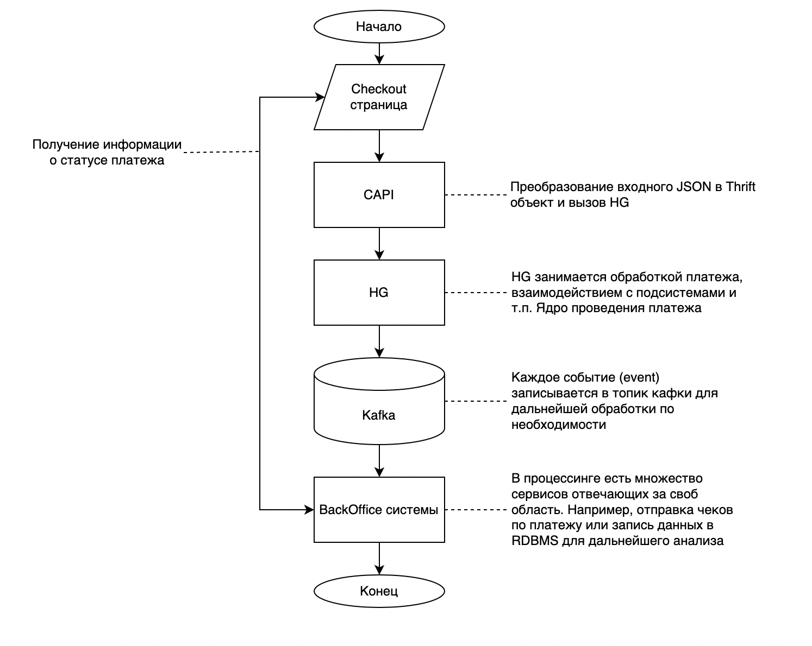

# Работа с платежами. Реализация

## Немного о платеже

Платеж - это перевод денежных средств со счета одного участника 
товарно-денежных отношений на счет другого. Способ проведения платежа
(при помощи карты, банковского перевода, qr-кода и т.п.) не имеет значения.

В процессинге Vality платеж условно можно разделить на 2 части: `invoice` и `payment`.
`Invoice` выступает в роли корзины и может содеражть в себе несколько платежей 
объединенных общими данными о клиенте, деталях платежа, различных дополнительных условиях.
`Payment` в свою очередь минимально делимая единица товарно-денежных отношений в системе 
и хранит в себе информацию о сумме и валюте платежа, данные о плательщике, идентификатор платежа 
и прочая метаинформация. В дальнейшем говоря о платеже будет иметься в виду связка
`invoice + payment`.

## Алгоритм проведения платежа

Работа с платежами является основной задачей `HellGate`. Он должен обеспечивать как высокую скорость работы, 
так и надежность выполнения. Стандартный подход к проведению платежа выглядит следующим образом:
1. Инициируется инвойс. Один инвойс может содержать в себе несколько платежей, а так же 
   метаинформацию о платежной операции (корзину покупок, данные о магазине и т.п.)
2. На основании существующего инвойса моздается платеж. Он может быть начат как на checkout странице 
   разработанной vality.dev, так и через API 
   (API прописано в [swag-payments](https://github.com/valitydev/swag-payments))
3. После этого платеж идет в [CAPI-PCIDSS](https://github.com/valitydev/capi-pcidss-v2). 
   Внутри `CAPI-PCIDSS` происходит анализ данных (есть ли необходимость мохранить 
   особо чувствительные данные в защищенное хранилище или нет) и возвращает ответ 
   (страница платежа использует данные, полученные от `CAPI-PCIDSS`, как аргумент 
   для создания платежа). 
4. Далее вызывается [CAPI](https://github.com/valitydev/capi-v2), данные маппятся 
   в thrift структуры и вызывается [метод создания платежа](https://github.com/valitydev/damsel/blob/master/proto/payment_processing.thrift#L1040).
   (`CAPI` вызывает `HellGate` и платеж начинает обрабатываться).
6. `Hellgate` обогащает входные данные дополнительной информацией, проводит проверки и обрабатывает платеж. 
7. Страница, инициирующая платеж, получает данные о статусе платежа

Краткая иллюстрация алгоритма проведения платежа представлена на рисунке ниже

Самым важным в данной схеме является этап обработки в `HG`, который далее и будет рассмотрен.

---

Далее:
- [абстактный алгоритм проведения платежа в Hellgate](abstract-hg-payment-workflow.md)
- [подробный алгоритм проведения платежа в Hellgate](hg-payment-workflow.md)
