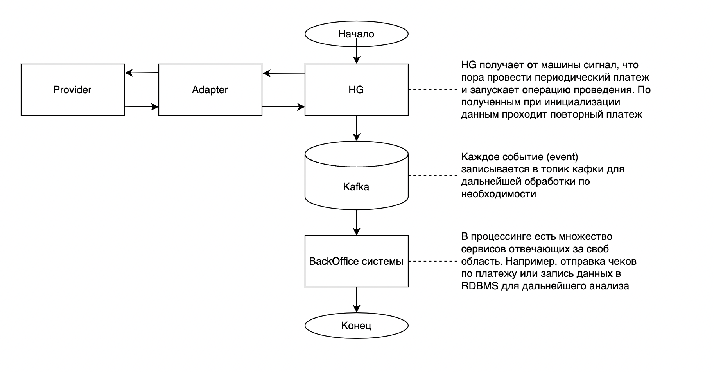

# Работа с рекуррентными платежами. Реализация

## Немного о рекуррентных платежах

Рекуррентные платежи это платежи, которые повторяются с определенной 
периодичностью. Первоначально плательщик инициирует привязку карты 
(чаще всего во время первого платежа за товар/услугу) после чего денежные 
средства будут списываться автоматически (раз в какой-то промежуток времени 
установленный продавцом).

## Алгоритм проведения платежа

1. Инициируется платеж. На checkout странице vality (или мерчанта) 
пользователем или самим мерчантом выставляется флаг необходимости 
создания рекуррентного платежа (API прописано в 
[swag-payments](https://github.com/valitydev/swag-payments))
2. После этого платеж попадает либо в [CAPI-PCIDSS](https://github.com/valitydev/capi-pcidss-v2)).
   Сервис выполняет роль единой точки входа через API (маппит данные и использует определенный исполнитель).
   В случае платежа с использованием [интерфейса, описанного в damsel](https://github.com/valitydev/damsel/blob/master/proto/payment_processing.thrift#L1040), CAPI вызывает HellGate и платеж начинает
   обрабатываться.
3. Hellgate обогащает входные данные дополнительной информацией, проводит проверки и обрабатывает первый 
рекуррентный платеж. Особенность данного типа платежа, что сначала происходит платеж-привязка
карты с данными периодичности платежа.
4. Страница, инициирующая платеж, получает данные о статусе платежа
5. Спустя некоторый промежуток времени согласно расписанию платежей заданному при 
инициализации происходит повторный платеж, который инициирует HG по своему таймеру
без участия пользователя. Если этот платеж прошел успешно, то подписка продлевается 
и услуга прдолжает предоставляться мерчантом. Иначе она прекращает свое действие.
6. Отказаться от подписки можно через банк эмитировавший карту, мерчанта и в платежной 
системе, но обычно пользователь использует личный кабинет мерчанта.

Абстактная схема этапа привязки похожа с этапом классического платежа и представлена 
на схеме ниже

Абстрактная схема повторного платежа

## Обработка первого платежа в HG

## Обработка последующих платежей в HG

