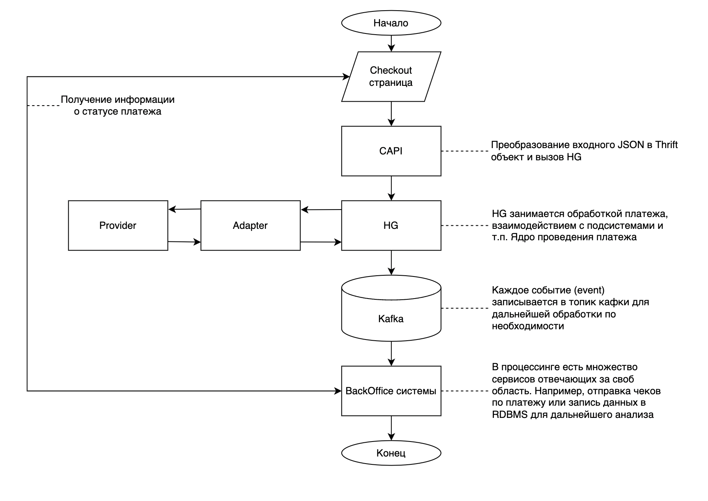

# Работа с рекуррентными платежами. Реализация

## Немного о рекуррентных платежах

Рекуррентные платежи это платежи, которые повторяются с определенной 
периодичностью. Первоначально плательщик инициирует привязку карты 
(чаще всего во время первого платежа за товар/услугу) после чего денежные 
средства будут списываться автоматически (раз в какой-то промежуток времени 
установленный продавцом).

## Алгоритм проведения платежа

1. Инициируется платеж. На checkout странице vality (или мерчанта) 
пользователем или самим мерчантом выставляется флаг необходимости 
создания рекуррентного платежа (API прописано в 
[swag-payments](https://github.com/valitydev/swag-payments))
2. После этого платеж попадает либо в [CAPI-PCIDSS](https://github.com/valitydev/capi-pcidss-v2)).
   Сервис выполняет роль единой точки входа через API (маппит данные и использует определенный исполнитель).
   В случае платежа с использованием [интерфейса, описанного в damsel](https://github.com/valitydev/damsel/blob/master/proto/payment_processing.thrift#L1040), CAPI вызывает HellGate и платеж начинает
   обрабатываться.
3. Hellgate обогащает входные данные дополнительной информацией, проводит проверки и обрабатывает первый 
рекуррентный платеж. Особенность данного типа платежа, что сначала происходит платеж-привязка
карты с данными периодичности платежа.
4. Страница, инициирующая платеж, получает данные о статусе платежа
5. Спустя некоторый промежуток времени согласно расписанию платежей заданному при 
инициализации происходит повторный платеж, который инициирует HG по своему таймеру
без участия пользователя. Если этот платеж прошел успешно, то подписка продлевается 
и услуга прдолжает предоставляться мерчантом. Иначе она прекращает свое действие.
6. Отказаться от подписки можно через банк эмитировавший карту, мерчанта и в платежной 
системе, но обычно пользователь использует личный кабинет мерчанта.

Абстактная схема этапа привязки похожа с этапом классического платежа и представлена 
на схеме ниже


Абстрактная схема повторного платежа


## Обработка первого платежа в HG

Последовательность действий после получения данных инициировачного периодического платежа 
от `CAPI` следующая:
1. Старт платежа в HG. Сначала внешняя система при помощи API описанного в damsel 
[создает инвойс](https://github.com/valitydev/damsel/blob/master/proto/payment_processing.thrift#L1042).
В него передается следующая структура:
```plantuml
struct InvoiceParams {
    1: required PartyID party_id
    2: required ShopID shop_id
    3: required domain.InvoiceDetails details
    4: required base.Timestamp due
    5: required domain.Cash cost
    6: required domain.InvoiceContext context
    7: required domain.InvoiceID id
    8: optional string external_id
    9: optional domain.InvoiceClientInfo client_info
    10: optional domain.AllocationPrototype allocation
}
```
Затем [создается платеж](https://github.com/valitydev/damsel/blob/master/proto/payment_processing.thrift#L1134).
В метод StartPayment передается ID ранее созданного инвойса и следующая структура:
```plantuml
struct InvoicePaymentParams {
    1: required PayerParams payer
    8: optional domain.PayerSessionInfo payer_session_info
    2: required InvoicePaymentParamsFlow flow
    3: optional bool make_recurrent
    4: optional domain.InvoicePaymentID id
    5: optional string external_id
    6: optional domain.InvoicePaymentContext context
    7: optional base.Timestamp processing_deadline
}
```
В структуре `InvoicePaymentParams` в рамках периодичного платежа важен
параметр `make_recurrent`, который должен быть установлен в `true`.

2. Получив входный данные Hellgate преобразует их и [создает новую машину](https://github.com/valitydev/machinegun-proto/blob/master/proto/state_processing.thrift#L416)
   в сервисе machinegun (интерфейс создания - [machinegun_proto.state_processing.Automation.Start](https://github.com/valitydev/machinegun-proto/blob/master/proto/state_processing.thrift#L416)).
   Структура [машины](https://github.com/valitydev/machinegun-proto/blob/master/proto/state_processing.thrift#L82) выглядит следующим образом:
```plantuml
/**
 * Машина — конечный автомат, обрабатываемый State Processor'ом.
 */
struct Machine {
    /** Пространство имён, в котором работает машина */
    1: required base.Namespace ns;

    /** Основной идентификатор машины */
    2: required base.ID  id;

    /**
     * Сложное состояние, выраженное в виде упорядоченного набора событий
     * процессора.
     * Список событий упорядочен по моменту фиксирования его в
     * системе: в начале списка располагаются события, произошедшие
     * раньше тех, которые располагаются в конце.
     */
    3: required History history;

    /**
     * Диапазон с которым была запрошена история машины.
     */
    4: required HistoryRange history_range;

    /**
     * Упрощенный статус машины
     */
    8: optional MachineStatus status;

    /**
     * Вспомогательное состояние — это некоторый набор данных, характеризующий состояние,
     * и в отличие от событий не сохраняется в историю, а каждый раз перезаписывается.
     * Бывает полезен, чтобы сохранить данные между запросами, не добавляя их в историю.
     */
    7: optional AuxState aux_state;

    /**
     * Текущий активный таймер (точнее, дата и время когда таймер сработает).
     */
    6: optional base.Timestamp timer;

    // deallocated / reserved
    // 5: optional AuxStateLegacy aux_state_legacy

}
```

3. Далее HG дозапрашивает метаинформацию из сервиса `dominant` ([интерфейс работы с dominant](https://github.com/valitydev/damsel/blob/master/proto/domain_config.thrift#L171)) (todo: какую?)
4. Получение дополнительной информации о пати-шопу из сервиса `party-management` ([интерфейс работы с party-management](https://github.com/valitydev/damsel/blob/master/proto/payment_processing.thrift#L2532)) (по необходимости)
5. Проверка платежа в антифрод системе `fraudo` ([интерфейс работы с антифродом](https://github.com/valitydev/damsel/blob/master/proto/proxy_inspector.thrift#L54))
6. [Роутинг](routing-workflow.md). Один из важнейших этапов при проведении платежа.
   Здесь определяется через какого провайдера и какой терминал будет осуществлен платеж.
   Выбор зависит от многих параметров, но основные это доступность провайдера, лимиты, 
   результат проверки антифродом, а так же возможность проведение периодических платежей.
7. После того как провайдер, через которого будет проведен платеж, был определен,
   происходит холдирование денежных средств в сервисе `shumway`
   ([интерфейс для работы с shumway](https://github.com/valitydev/damsel/blob/master/proto/accounter.thrift#L120))
8. После этапов описанных выше `HG` формирует [PaymentContext](https://github.com/valitydev/damsel/blob/master/proto/proxy_provider.thrift#L265)
   и с использованием данных полученных после роутинга взаимодействует с [адаптером к провайдеру](https://github.com/valitydev/damsel/blob/master/proto/proxy_provider.thrift#L341)
9. Адаптер реализует базнес логику по взаимодействию с конкретным провайдером. Первый этап для любого платежа
   PROCESSED. В зависимости от внутренней логики адаптера вернуться в `HG` может несколько варианов: Sleep, Suspend, Finish.
   Финализирует этап возврат Finish состояния (может быть Success и Failed)
10. Если получен Failed состояние, то платеж завершается (машина переводится в состояние Failed),
    если Success, то переходим к следующему этапу.
11. Дальнейшие действия зависят от того какие настройки были заданы для провайдера.
    Обычно периодческий платеж проходит по одностадийной схеме, поэтому после завершения
    этапа PROCESSED платеж сразу переводится в CAPTURED.
12. По полученным от провайдера данным машина устанавливает таймер и ожидает момента, 
    когда нужно будет провести повторный платеж.

Для данного этапа схема в целом аналогчина той, что представлена для нерекуррентного платежа.

## Обработка последующих платежей в HG

1. В машине, хранящейся в `MG`, сразабывает таймер, установленный на этапе завершения 
инициализирующего рекуррентного платежа. `MG` вызывает `HG`.
2. HG получает от MG контекст, инифиирует новый рекуррентный платеж, 
дозапрашивает дополнительную информацию и отправляет 
его конкретному провайдеру, который был использован при первом платеже.
3. Адаптер получает контекст от `HG`, и отправляет запрос на списание денежных средств 
4. Если списание прошло успешно, то платеж переводится в `CAPTURED`. Важно: в мете 
платежа всегда указан ID первого платежа, а специфика работы с провайдером по части 
периодического платежа в extra map (поле TransactionInfo)

